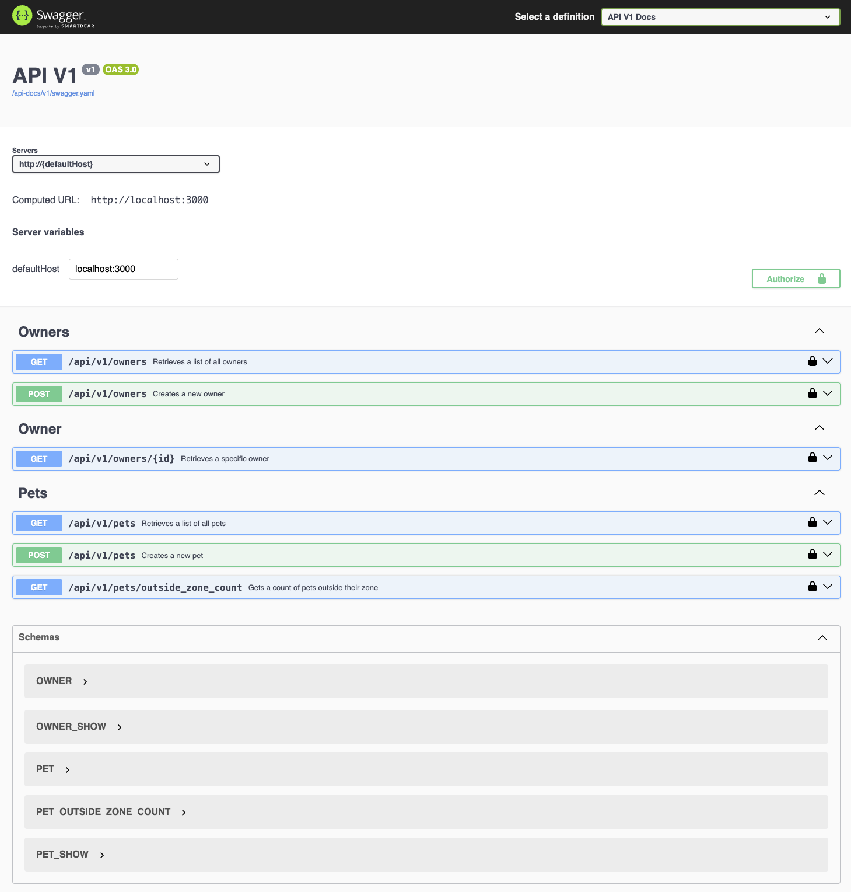

#  Pet Tracking Application

This project is a Ruby on Rails API that tracks pets (cats and dogs) using data from different types of trackers. It allows external systems to send pet tracking data through a RESTful API, stores that information, and provides endpoints to query which pets are currently outside the power-saving zone.

The app includes validation rules (e.g., only cats can have lost trackers), supports grouped counts by pet and tracker type, and is designed to use an in-memory database with the option to switch to a persistent one later.

Development follows a test-driven development (TDD) approach, with comprehensive RSpec and Rswag tests ensuring correctness, maintainability, and up-to-date API documentation.

## Installation

Please use This guide will walk you through installing the Ruby programming language and the Rails framework on your operating system.

### Install Ruby on macOS

You'll need macOS Catalina 10.15 or newer to follow these instructions.

For macOS, you'll need Xcode Command Line Tools and Homebrew to install dependencies needed to compile Ruby.

Open Terminal and run the following commands:

```
xcode-select --install
/bin/bash -c "$(curl -fsSL https://raw.githubusercontent.com/Homebrew/install/HEAD/install.sh)"
echo 'export PATH="/opt/homebrew/bin:$PATH"' >> ~/.zshrc
source ~/.zshrc
brew install openssl@3 libyaml gmp rust
curl https://mise.run | sh
echo 'eval "$(~/.local/bin/mise activate)"' >> ~/.zshrc
source ~/.zshrc
mise use -g ruby@3
```
Once Ruby is installed, you can verify it works by running:
```
$ ruby --version
ruby 3.4.4
```

### Installing Rails

Run the following command to install the Rails and make it available in your terminal.
```
$ gem install rails
```
To verify that Rails is installed correctly,
```
$ rails --version
Rails 8.0.0
```
For other operating systems please refer following link.
https://guides.rubyonrails.org/install_ruby_on_rails.html

### Setup & Run the Application

1.  Clone the repository.
```
git clone https://github.com/kaushik0911/fantastic-fiesta.git
```
2. Navigate to the project directory.
```
cd fantastic-fiesta
```
3. Install dependencies.
```
bundle install
```
4. Run migrations - This will create the database in SQLite and run the migrations.
```
rails db:migrate
```
5. Start the server.
```
rails s
```
6. To run tests.
```
rails t
```
and,
```
bundle exec rspec
```
7. To generate API documentation.
```
rake rswag:specs:swaggerize
```
8. Open the API documentation in your browser and you try the API endpoints.
```
http://localhost:3000/api-docs/index.html
```
and Auth key is `5SEQiXwKfCElf2zpBKbRjbVbfZ1Ws9pfFo7ReDhlXC9XD1uRiH2jVce384Hu5Oqe` since this is a sandbox project.

